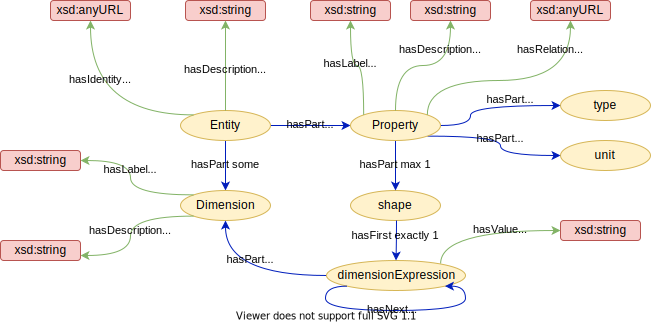
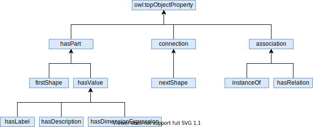
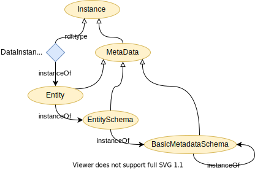
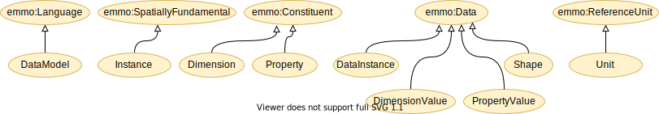

Datamodel ontology
==================
An ontological description of a simple data model aimed to make
application specific data semantic interoperabel.

The basic idea is that the data model should stay very close to the
way the application repesents its data.  At the same time, the data
model allows easy mapping the elements in the data model (entities,
dimensions and properties) to a globally shared ontology and thereby
enable semantic interoperability.

This ontology only describes the data model.  A set of accompanying
tools is needed in order to achieve actual interoperability in real
applications.

Short description of the data model ontology
--------------------------------------------
The root concept in the taxonomy of this ontology is called **DataModel**.

### Entity
The **Entity** is the most central concept in this ontology.  It is the class of individuals that represent any self-contained piece of information.  In addition has it the following parts (composition):
- **identity**: identifies uniquely the entity.  Even though all ontological concepts are uniquely identified via their IRI, the identity is an explicit part of a data model and should therefore be included here.
- **description**: a human description of the entity.
- **dimensions**: zero or more named dimensions, which are referred to by the property shapes (see below).  A dimension has two parts:
  - **label**: a label identifying the dimension within the entity.
  - **description**: a human description of this dimension.
- **properties**: a set or properties describing the underlying data.  A property has the following paths:
  - **label**: a label identifying the property within the entity.
  - **type**: the data type of the property. More specific types, like integer, float, string etc... are subclasses of Type.  Type may also be a reference to another entity.  They are implementation-specific and are not included in this ontology.
  - **relation**: In case type refer to another entity, relation specifies how this and the other entity are related.
  - **shape**: The shape of the property.  It is a ordered list of DimensionExpressions.  For example `["N", "N+1"]` where "N" is a dimension label.  Actual implementations may leave the shape optional.
  - **unit**: the unit of the property.  Would typically refer to other ontologies, like EMMO, QUDT or OM, or simply be a conventional symbol for the unit (e.g. "km/h").
  - **description**: a human description of the property.

Figure 1 shows the relations between the entity and its parts.

_Figure 1: The relations the Entity parts.  The taxonomy is not shown for clarity._

#### Relations
The basic entity ontology does not depend on EMMO, but still categorises its relations in terms of parthood (EMMO mereology and UML composition), connections (EMMO topology and UML aggregation) and associations (EMMO semiotics and UML association).  The relation taxonomy is shown in Figure 2.

_Figure 2: Relation taxonomy._

Everything described so far is formally defined in the [entity.ttl](entity.ttl) turtle file.

### DLite metadata hierarchy
[DLite](https://github.com/SINTEF) introduces a metadata hierarchy, which is not part of the basic datamodel ontology.  Like in Python, where everything is an object, everything is an instance in DLite.  All metadata is for example an instance of its meta-metadata and is therefore an instance.  This is shown in Figure 3.  In addition dlite introduces different levels of metadata, where DataInstance is an instance of Entity, Entity is an instance of EntitySchema, EntitySchema is an instance of BasicEntitySchema and BasicEntitySchema is an instance of itself.

Note that this multi-level of abstractions cannot be described with first order logic, but requires second order logic.  In order to describe the DLite metadata hierearchy with description logic (which is a subset of first order logic), we introduce the `instanceOf` relations.  One should think about it as `rdf:type`, but without the constrain that the domain must be an individual.  Since `instanceOf` is not an OWL object property, it is not included in Figure 2 above.

_Figure 3: The DLite metadata hierarchy._

### Connection to EMMO
When connecting to EMMO, the datamodel ontology is describing as a formal language. .  That instances and entities are self-contained are reflected in making them subclasses of spatially fundamental wholes.  Their parts are therefore constituents.  Data instances, shapes, dimension- and property values are subclasses of emmo:Data.  Unit is a emmo:ReferenceUnit, but may also refer to units in other ontologies.  This is shown in Figure 4.

_Figure 4: Connection to EMMO._

Short description of the provided turtle files
----------------------------------------------
- [entity.ttl](entity.ttl) defines the basic datamodel as a standalone turtle file.
- [datamodel.ttl](datamodel.ttl) imports [entity.ttl](entity.ttl) and links it to EMMO.
- [dlitemodel.ttl](dlitemodel.ttl) imports [datamodel.ttl](datamodel.ttl) and adds a few specialisations that are specific to the dlite implementation, like that entities are actually subclasses of objects, etc.

References
----------
1. A Practical Approach to Ontology-Based Data Modelling for Semantic Interoperability, https://www.scipedia.com/public/Hagelien_et_al_2021a

Attributions and credits
------------------------

### Contribruting projects

- [MarketPlace](https://www.the-marketplace-project.eu/);
  Grant Agreement No: 760173
  
- [OntoTrans](https://ontotrans.eu/project/);
  Grant Agreement No: 862136
  
- [OpenModel](https://openmodel.eu/project/);
  Grant Agreement No: 862136
- [VIPCOAT](https://cordis.europa.eu/project/id/952903)
  Grant Agreement No: 952903

### Contributors and contacts

- Thomas Hagelien (Thomas.F.Hagelien(at)sintef.no)
- Jesper Friis (jesper.friis(at)sintef.no)

License
-------
The datamodel ontology is released under the [Creative Commons Attribution 4.0 International](https://creativecommons.org/licenses/by/4.0/legalcode) license (CC BY 4.0).
