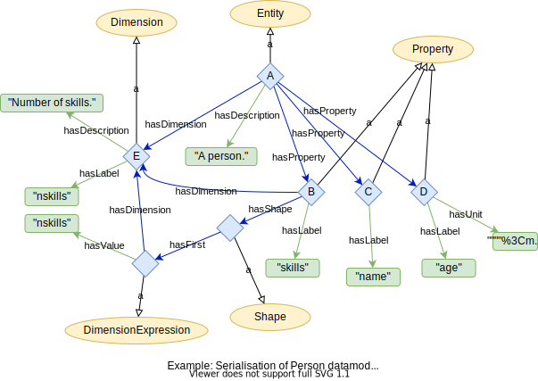
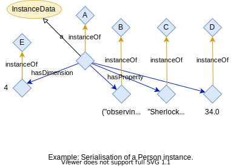

Serialisation of datamodels and instances in RDF
================================================
This document tries to illustrate how the datamodel ontology can be used
via a simple example.


Serialisation of an Entity
--------------------------
Lets start with a simple entity for a person as example that in json,
would look like:

```json
{
  "uri": "http://onto-ns.com/meta/0.1/Person",
  "description": "A person.",
  "dimensions": {
    "N": "Number of skills."
  },
  "properties": {
    "name": {
      "type": "string",
      "description": "Full name."
    },
    "age": {
      "type": "float",
      "unit": "years",
      "description": "Age of person."
    },
    "skills": {
      "type": "string",
      "dims": ["N"],
      "description": "List of skills."
    }
  }
}
```

Figure 1 shows how it would look like serialised in RDF.



where the individuals labeled `A`, ..., `E` are shorthands for the
following IRIs:

| shorthand | IRI |
| --------- | --- |
| A | <http://onto-ns.com/meta/0.1/Person> |
| B | <http://onto-ns.com/meta/0.1/Person#skills> |
| C | <http://onto-ns.com/meta/0.1/Person#name> |
| D | <http://onto-ns.com/meta/0.1/Person#age> |
| E | <http://onto-ns.com/meta/0.1/Person#nskills> |

Hence <http://onto-ns.com/meta/0.1/Person> is an individual that
stands for the Person entity. The IRIs for the dimensions and
properties are constructed by appending a hash and then the
corresponding label to the IRI of the entity.

Serialised in turtle the Person entity would look like

```turtle
@prefix : <http://emmo.info/datamodel/ex1#> .
@prefix rdf: <http://www.w3.org/1999/02/22-rdf-syntax-ns#> .
@prefix dm: <http://emmo.info/datamodel#> .
@prefix person: <http://onto-ns.com/meta/0.1/Person#> .

<http://onto-ns.com/meta/0.1/Person> rdf:type dm:Entity ;
    dm:hasProperty person:name , person:age , person:skills ;
    dm:hasDimension person:nskills ;
    dm:hasDescription "A person."@en .

person:name rdf:type dm:Property ;
    dm:hasLabel "name"@en .

person:age rdf:type dm:Property ;
    dm:hasUnit "year" ;
    dm:hasLabel "age"@en .

person:skills rdf:type dm:Property ;
    dm:hasDimension person:nskills ;
    dm:hasShape :shape1 ;
    dm:hasLabel "skills"@en .

person:nskills rdf:type dm:Dimension ;
    dm:hasLabel "nskills"@en ;
    dm:hasDescription "Number of skills."@en .

:shape1: rdf:type dm:Shape ;
    dm:hasFirst :dimexpr1 .

:dimexpr1: rdf:type dm:DimensionExpression ;
    dm:hasDimension person:nskills ;
    dm:hasValue "nskills" .
```


Instance
--------
Lets now consider an instance of a person that in json would look like

```json
{
  "315088f2-6ebd-4c53-b825-7a6ae5c9659b": {
    "meta": "http://meta.sintef.no/0.1/Person",
    "dimensions": {
      "N": 4
    },
    "properties": {
      "name": "Sherlock Holmes",
      "age": 34.0,
      "skills": [
        "observing",
        "chemistry",
        "violin",
        "boxing"
      ]
    }
  }
}
```

Figure 2 show how this instance may look like serialised as RDF, where
the instances `A`, ..., `E` refer to the same instances as in the
figure above.



Serialised in turtle this instance would be

```turtle
@prefix : <http://emmo.info/datamodel/ex1#> .
@prefix rdf: <http://www.w3.org/1999/02/22-rdf-syntax-ns#> .
@prefix xsd: <http://www.w3.org/2001/XMLSchema#> .
@prefix dm: <http://emmo.info/datamodel#> .
@prefix person: <http://onto-ns.com/meta/0.1/Person#> .

:person1 rdf:type dm:InstanceData ;
    dm:hasUUID "315088f2-6ebd-4c53-b825-7a6ae5c9659b"^^xsd:string ;
    dm:instanceOf <http://onto-ns.com/meta/0.1/Person> ;
    dm:hasDimension :dim1 ;
    dm:hasProperty :name1 , :age1 , :skills1 .

:dim1 rdf:type dm:DimensionValue ;
    dm:instanceOf person:nskills ;
    dm:hasValue "4"^^xsd:integer .

:name1 rdf:type dm:PropertyValue ;
    dm:hasValue "Shelock Homes"^^xsd:string .

:age1 rdf:type dm:PropertyValue ;
    dm:hasValue "34.0"^^xsd:float .

:skills1 rdf:type dm:PropertyValue ;
    dm:hasValue ( "observing"@en "chemistry"@en "violin"@en "boxing"@en ) .
```
